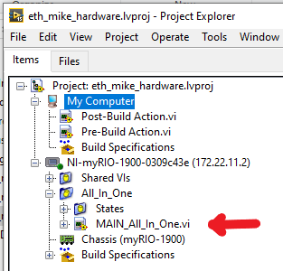

### How to open the main LabView Program

1. Go to the folder where the LabView code is located (eth-mike-hardware)

2. Double click on the `eth_mike_hardware.lvproj` (the one with an icon)

3. Double click on the `MAIN_All_In_One.vi` located in the `All_In_One` folder, see picture

   

4. Click on `Window` -> `Show Block Diagram`