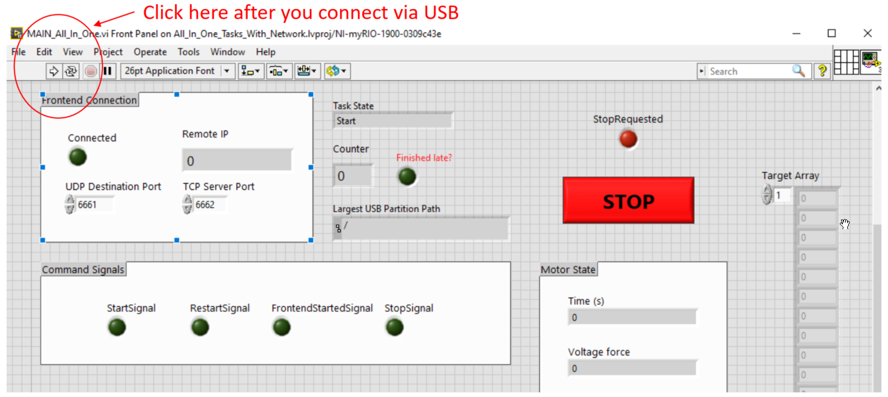
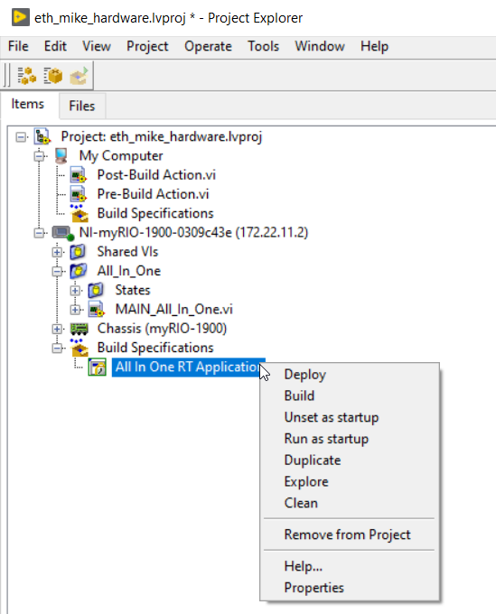

### How to run the Labview code
After connecting to the Hardware via USB and [opening the Labview program](HowToOpenMainLabviewProgram.md), the program can be run via the start button shown in the picture.

### How to deploy the Labview code

The program can be deployed on the myRIO, so that is automatically run on start up. For this, open the `eth_mike_hardware.lvproj`.
Open the `Main_All_In_One.vi` and make sure that the correct Mike version is selected in the Block diagram. Save the VI in order to store any changes here. Go back to the Labview project overview.
Right click on `All In One RT Application` as shown in the following picture. 

Then
1. `Build`
2. `Deploy`
3. `Run as startup` (for this you need login: admin, password: admin)