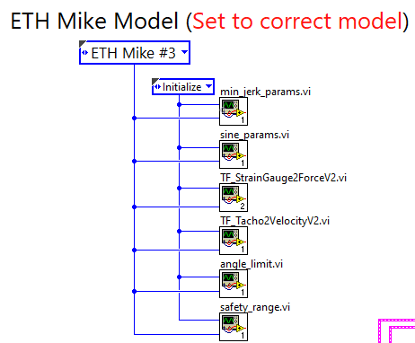
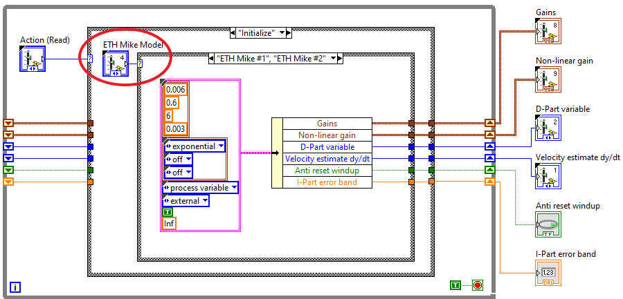
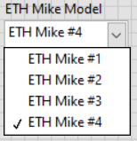
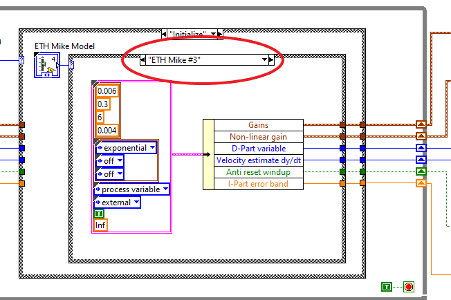

### How to support new Mike Harware in the LabView code

1. [Open the main `MAIN_All_In_One` labview program](HowToOpenMainLabviewProgram.md)

2. Navigate to the part of the Block Diagram where the ETH Mike can be selected. See picture.
3. 
   

3. Double click on the first SubVi `min_jerk_param.vi` and switch to the Block Diagram view (`Ctrl+E`)

4. Right click on `ETH Mike Model` icon (see picture) and select `Open Type Def.`.
6. 
   

5. Open the dropdown menu `ETH Mike Model` (see picture) and select the last element. This makes sure the new element will be added at the end. Now right click on the dropdown menu and select `Add item after`. Enter `ETH Mike #x` into the prompt, where `x` is the model number of the Hardware. In general, Mike versions are enumerated in ascending order. 

   

6. Save (`Ctrl + S`) and close the `ETHMikeModel.ctl`.

7. In the `min_jerk_params.vi`, select the lastest Mike version in the case structure. Right click on the label (see picture) and select `Duplicate Case`. Enter the name of the new Mike version `ETH Mike #x` into the prompt.
   
   

8. Adjust the parameters for the new added case.

9. Repeat steps 4 to 8 with the other SubVis shown in the picture of step 2.
   * min_jerk_params.vi – parameters of the PID with minimum jerk trajectory
   * sine_params.vi – parameters of the PID with sine wave trajectory
   * TF_StrainGauge2ForceV2.vi – transfer function of voltage to force (requires calibration of the force sensor using weights)
   * TF_Tacho2VelocityV2.vi – transfer function of voltage to velocity (requires calibration of the velocity comparing to the derivative of position from the encoder)
   * angle_limit.vi – this has to do with range of motion of ETH MIKE #1 being smaller than for all other models. Keep the same value as ETH MIKE #2 and above
   * safety_limit.vi - this has to do with range of motion of ETH MIKE #1 being smaller than for all other models. Keep the same value as ETH MIKE #2 and above

