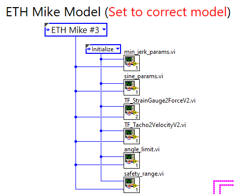

# Tuning of ETH MIKE

Use the [PID_Tuning.vi](https://gitlab.ethz.ch/RELab/eth-mike/eth-mike-back-end/-/blob/master/PID%20Tuning/PID_Tuning.vi) to tune a new MIKE or finetune an existing MIKE.
It can be used both for finding the correct tachometer parameters as well as tuning PID parameters.

- Before running the VI, choose the correct MIKE version as shown in the Block Diagram view. For a new MIKE version follow this [instruction](https://gitlab.ethz.ch/RELab/eth-mike/eth-mike-back-end/-/blob/master/Docs/HowToSupportNewMikeHardwareInLabviewCode.md). Start the tuning procedure of a new MIKE by adding a new MIKE version!

- When the VI is started, the tachometer parameter from the selected MIKE Model are loaded and the PID parameters are set to 0.
 

- It is possible to record all relevant data at any time. This can be done by entering a non existing file name into the `TDMS Storage File Input` field and press the `Save data?` button. The logging of the data is either stopped by clicking again on `Save data?` or by stopping the whole program. The data can be downloaded from the MyRIO from `http://172.22.11.2/files/media/sda1/`. (it is convenient to use `Map network drive` in the Windows file explorer). TDMS files can be opened by Excel when Labview is installed.

- Before the controller can be tuned, the tachometer parameter have to be tuned, so that the velocity information used by the controller is correct.
 
### Tuning

1. Run the `PID_Tuning.vi`.

2. First, the tachometer `Offset [V]` value has to be chosen correctly. For this the endeffector has to be at rest. The `Offset [V]` value can be adjusted in real time until the `Tachometer` curve in the `Velocity` graph is around 0.

3. Next, the tachometer `Gain [deg/sV]` value needs to be chosen correctly. For this the endeffector should be moved back and forth by hand. The goal is to match the `Tachometer` curve to the `Encoder Derivative` curve in the `Velocity` graph. The `Tachometer` velocity value can be scaled by adjusting the `Gain [deg/sV]` in real time in the VI. A good result of this is shown in the figure below.
   
   **Attention:** Only use positive `Gain [deg/sV]` values. If the velocity curve is flipped, solve this on the hardware level by flipping the connectors at the tachometer motor.

4. Write down both values `Offset [V]` and `Gain [deg/sV]` and stop the `PID_tuning.VI`. Write the tachometer parameter file into the [parameter file](https://gitlab.ethz.ch/RELab/eth-mike/eth-mike-back-end/-/blob/master/Shared%20VIs/ModelSpecific/Tacho2Velocity_params.vi). Make sure to save it for the correct MIKE version only. After this step, the correct tachometer values will be automatically loaded once the `PID_Tuning.vi` is started.

### PID parameter tuning

**Attention**: While tuning the controller, **keep the emergency stop near you.** Wrong parameter values could lead to instabilities. It is best to cushion the mechanical end stops to not damage the load cell in case of an instability. 

1. Run the `PID_Tuning.vi`.

2. In case you want to adjust the current tuning, you can load the current tuning by selecting the correct MIKE version an press `Load tuning parameters`.

3. Tuning values can be adjusted in the `PID Settings`. It is recommended not to adjust those values while the controller is active, as this might lead to instabilities.

4. Different trajectory types can be chosen in the `Trajectory Type` dropdown menu (MinJerkTrajectory, Ramp, Sinus). The duration and size of the trajectory can be selected as well.

5. The trajectory is executed when the `Run` button is pressed. Once the trajectory is finished, the controller stays active and keeps the endeffector at the target position. To disable the controller again, press 'Run' again. The endeffector can now be moved freely again.

6. Use the provided graphs to tune the controller until a good performance is reached. The goal is to have a smooth movement and little overshoot. It is possible to store separate PID values for min jerk trajectories and for sinusoidal trajectories, but it is likely that the same values can be used for both types of trajectories.
   
   Make sure you know how to tune a PID controller before starting. Good practice when tuning from scratch: Start with p-part, Add some d-part to damp the oscillation, Add i-part until static errors are removed. An concrete Example can be found [here](Tuning_Example.docx).

7. Write down all PID values and store them in [min_jerk_params.vi](https://gitlab.ethz.ch/RELab/eth-mike/eth-mike-back-end/-/blob/master/Shared%20VIs/ModelSpecific/min_jerk_params.vi) and [sine_params.vi](https://gitlab.ethz.ch/RELab/eth-mike/eth-mike-back-end/-/blob/master/Shared%20VIs/ModelSpecific/sine_params.vi). Make sure to save it under the right MIKE version.

8. The Main application should be [deployed](HowToRunTheLabviewProgram.md) again in order for the new PID values to take affect.